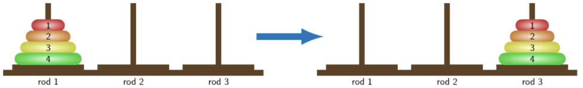
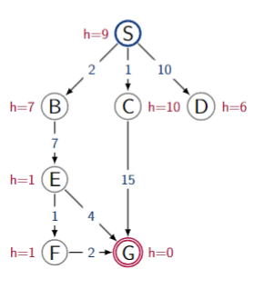

# Class 1: Solving Problems by Searching

These exercises are a good practice for Assessement 1 and for the exam.

1. The Tower of Hanoi is a puzzle where there are 3 rods and N disks of diameters 1, 2, . . . , N , which can slide onto any rod. The puzzle begins with the disks stacked on the first rod in order of decreasing size, the smallest at the top. The objective of the puzzle is to move the entire stack to the last rod, obeying the following rules:

- Only one disk may be moved at a time.
- Each move consists of taking the upper disk from one of the stacks and placing it on top of another stack or on an empty rod.
- No disk may be placed on top of a disk that is smaller than it

Below are the initial and goal configurations for the instance of the Tower of Hanoi with 4 disks.

**(a)** Formulate the Tower of Hanoi as a search problem by filling in the remaining parts.

(i) States: Each state is described by the set of disks (can be empty) on each rod. Each disk (one of 1, . . . , N ) appears on one rod exactly.

- Formally, this can be written as follows. Each state is (D1, D2, D3), where ∅ ⊆ Di ⊆ {1, . . . , N } and D1 ∪ D2 ∪ D3 = {1, . . . , N }.

(ii) Actions:

- Move one disk at a time
- Move top disk to empty rod
- Move top disk to rod with a larger disk below it

(iii) Successor function:

(iv) Start state:

All rods placed on the right-most rod, with disks organised from top to bottom largest to smallest

(v) Goal state:

All rods placed on the right-most rod, with disks organised from top to bottom largest to smallest

_Hints:_

_• Describe the actions unambiguously (you can list all of them explicitly, or using a formula)._

_• For other parts you can use generic descriptions, similar to the examples given in the lectures._

**(b)** Is the heuristic computing ‘N − the number of disks on rod 3’ admissible? If yes, they explain why. If not, provide a counterexample (i.e., a state for which the heuristic returns an estimate that is larger than the true cost).

2. Consider the search graph shown below. S is the start state and G is the goal state. The
actions costs (relevant to uniform-cost, greedy and A∗ searches) are shown on the arrows. The heuristic values (relevant to greedy and A∗ searches) are shown next to the states.

**(a)** For each of the following search strategies, give the solution path that would be returned, or write none if no path will be returned. If there are any ties, assume alphabetical tiebreaking (i.e., nodes for states earlier in the alphabet are expanded first in the case of ties).

(i) Depth-first search

SBEFG

(ii) Breadth-first search

SBEFG

(iii) Uniform cost search

SBEFG

(iv) Greedy search

SBEG

(v) A∗ search

SBEFG

_Hint: for parts (a), (b) and (c) first do all parts for one strategy, e.g., starting from Depth-first search, then for another strategy, etc._

**(b)** For each of the following search strategies, give the content of the frontier just before expanding for the third time (expanding ⟨S⟩ is the first time).

(i) Depth-first search

(ii) Breadth-first search

(iii) Uniform cost search

(iv) Greedy search

(v) A* search

_Note: the search algorithm works by:_

_1. Removing a node (which is a path) from the frontier._

_2. If the end state of the node is a goal state, search returns the node as the solution path._

_3. Otherwise it expands the node by computing new paths, adds them to the frontier and goes back to Step 1._

_At the start the frontier contains only the path ⟨S⟩. “The search expands for the first time” when ⟨S⟩ is removed from the frontier and new paths ⟨S, B⟩, ⟨S, C⟩, ⟨S, D⟩ are computed. For all search strategies, these are the paths that are added to the frontier after the search expands for the first time. The next time the search removes a node from the frontier and computes new paths is when it “expands for the second time”, etc._
